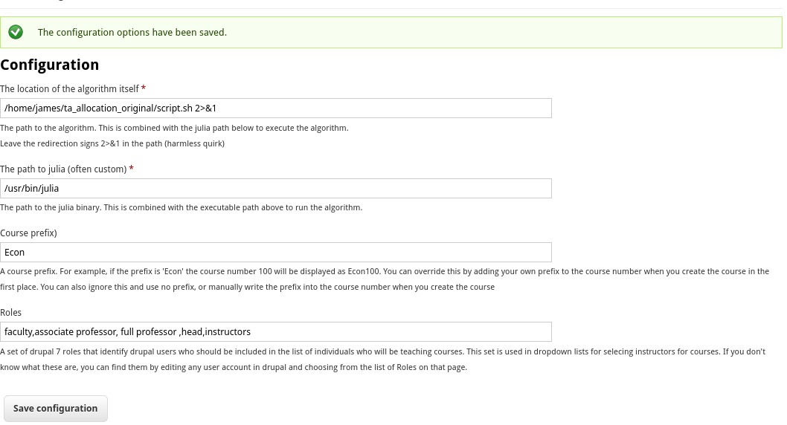

# Configuration

## Requirements

The administrative interace to the database system that drives the allocation is written for drupal 7 - time pressure during development.  If you aren't familiar with drupal, the current version of drupal is drupal 10.  Drupal 10 is fine, but it is nothing at all like drupal 7.  Basically, it is a completely different framework.  Updating the software here for drupal 10 would require a major amount of work. It would be about the same challenge as rewriting the interface here for laravel, or wordpress.   At the moment, the life of drupal 7 is extended every year.

Since it is drupal, it is written in php.  Database is mariadb (or mysql) and some features are mysql specific.

The algorithm itself is written in julia.  It current version uses a rest api (which must be configured) to feed it data.  The reason for this quirk is that you 
may want people to work on the algorithm in julia without giving them access to your database.  Simple api software that will work is included in the software bundle, but you'll have to configure drupal and apache to use it.

## Required Configuration

There is a basic configuration form at `https://yourwebsite.ca/ta_alloc/config`.



There are four settings on the form.  The first two are julia specific settings and you probably don't have to change them. 

The third setting is a prefix for your courses.  If you set this, then you can use numbers when you specify a course name.  If you set the course name to be 100, then it will render everywhere as Econ100 as it is set above.  If you set a course name with a prefix of its own, it will override this setting.

If you just set all your course names with their own textual prefixes, this setting will have no effect.

The fourth setting is faculty roles.  These are different for every drupal site.  You can see the list of roles on your site (assuming you have adminstrative permissions) by editing any user account and looking at the possible role assignments.  Add a comma separated list of role, with each role written exactly as you see it on the user page.

This is used to assemble the list a drupal accounts that belong to people who should be included in the list of instructors to which lectures can be assigned.

## Drupal Settings

The final setting needed is to tell drupal the name of the database that contains the ta allocation data.  Add a string like the following to your `settings.php` file in the `$databases` array.
```
'ta_allocation' => 
  [
    'default' => 
      [
           'database' => 'ta_allocation',
           'username' => 'username',
           'password' => 'password',
           'host' => 'localhost',
           'port' => '',
           'driver' => 'mysql',
           'prefix' => '',
      ],
  ],

```
Of course, replace the username and password with the strings that are appropriate for your application. 