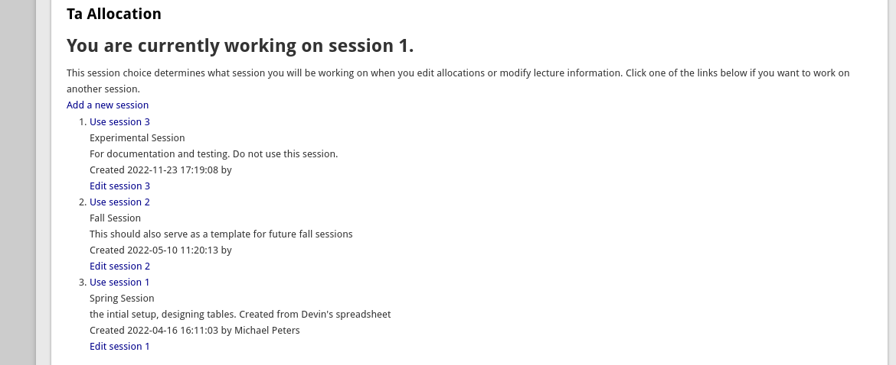
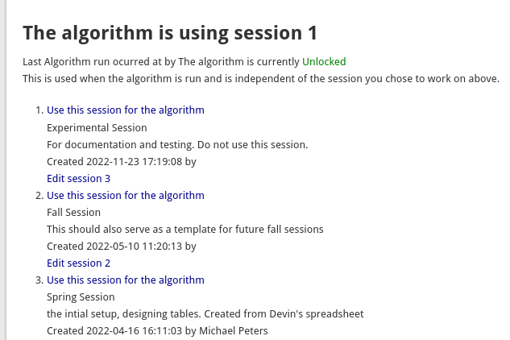

# Session Management

The very first step in configuration is to create sessions, one for each term, or quarter.  

The admin page opens when you click the top menu link which points to [https://yourwebsite.ca/ta_alloc](https://yourwebsite.ca/ta_alloc). The admin page looks like this:

 
 
 Three sessions have already been created - one for spring and fall, and a fake session that will be used mostly for this documentation.

 If you click the create session button, for example to set a summer session, you'll get a new form to fill out.  There are only two fields, the name of the session and a short note describing what it is for.  Don't worry about the name or your  notes, you can change them later by using the edit session link.

 ## Which session to use

 Once you have created you sessions, you can also use this list to choose which session to `work` on.  What that means when you make changes in the other section, for example by creating a new allocation for a student or course, you will be adding those to the data that prevails for the session you have chosen here.  

 This is something to remember when you find unexpected things happening, and realize it is possible you are working on the wrong data.

 You choice here is user specific - you are only choosing the data you will be working on.  Anyone else will have to choose their own session.

 ## What Sessions do others see
  You may need to figure out what other people are seeing when you make changes.  For example, students have to express preferences over their courses and you might be wondering if they will be able to see your changes.

  This is determined by the second section on this this page with section title `The algorithm is using session `.

  